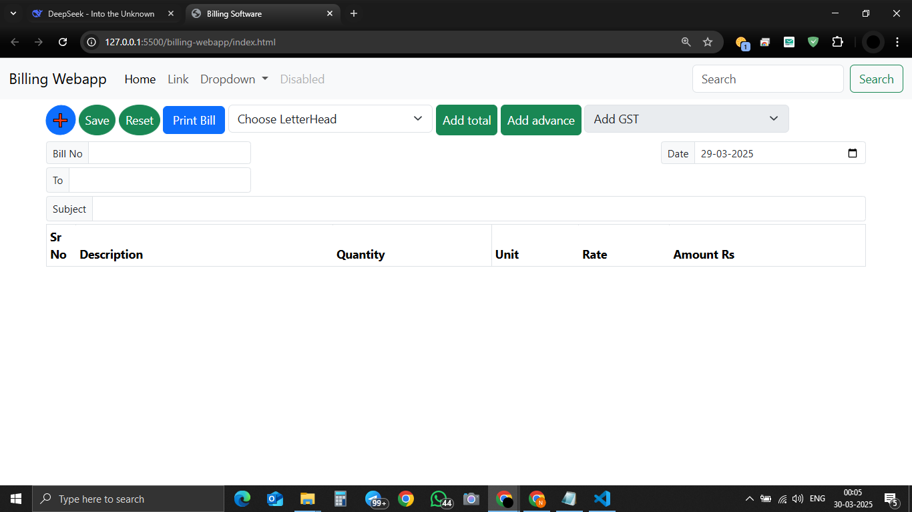
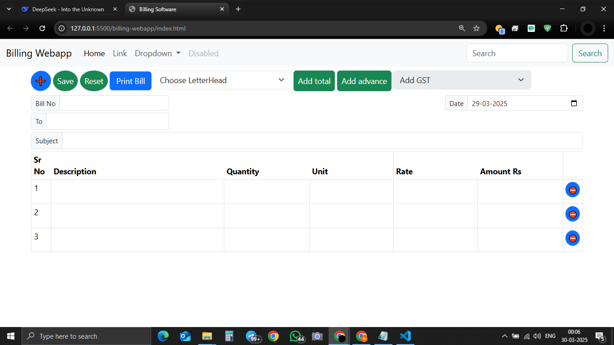
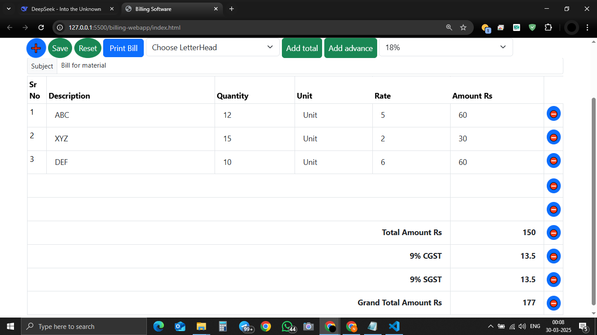

# 💰 Billing Software (Vanilla JS)





A **responsive billing web app** with GST calculation, custom letterheads, and print functionality—built with pure JavaScript!

## ✨ Features
- ✅ Dynamic bill item addition/deletion
- 📊 GST calculation (3% to 28%)
- 🖼️ Custom letterhead (Image/Text upload)
- 🖨️ Print-ready bill formatting
- 💾 LocalStorage auto-save

## 🛠️ Tech Stack
- **Frontend**: HTML5, CSS3, Vanilla JavaScript
- **UI**: Bootstrap 5
- **Tools**: Git, GitHub

## 🚀 Quick Start
1. Clone repo:
   ```bash
   git clone https://github.com/yourusername/billing-software.git
